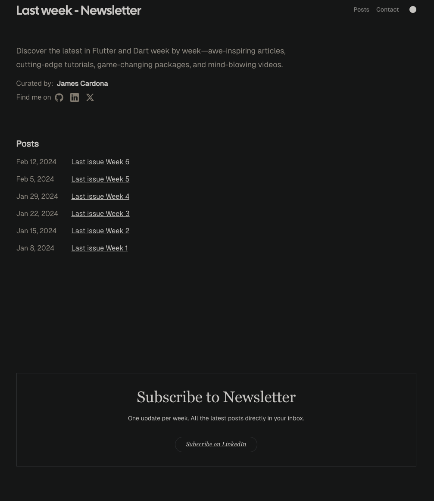

# Flutter last week - Newsletter

Base in this REPO: [Blogfolio](https://github.com/jamescardona11/blogfolio-astro)
    
Discover the latest in Flutter and Dart week by week—awe-inspiring articles, cutting-edge tutorials, game-changing packages, and mind-blowing videos.

## Demo

[Live Demo](https://last-week-newsletter.vercel.app/) - Deployed on Vercel.

[Realiza una solicitud de API a ChatGPT 4 con Next.js utilizando Javascript](https://medium.com/@JohanFriedner/realiza-una-solicitud-de-api-a-chatgpt-4-con-next-js-utilizando-javascript-190ba938dac6) 
Learn to make an API request to Chatbot GPT-4 with JavaScript and Next.js on Medium.

